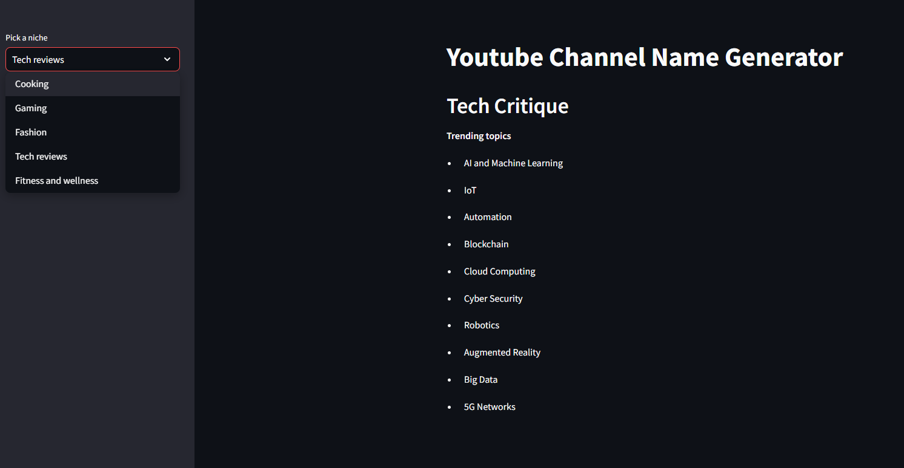

# LangChain Application

Langchain is a framework that allows us to build applications using LLMs
In this project we are using llm called OpenAI using Langchain framework.

A brief description of what this project does: 
We have a built an application which will help our user to suggest their channel name given the name of the niche they are interested in also will suggest some trending topics to make content on.

## Installation of modules

Install necessary modules by running following command

```bash
  pip install -r requirements.txt
```
otherwise

```bash
  pip install langchain
  pip install openai
  pip install streamlit
```

## Environment Variables

To run this project, you will need to add the following environment variables to your .env file

`openapi_key`

## Screenshots



